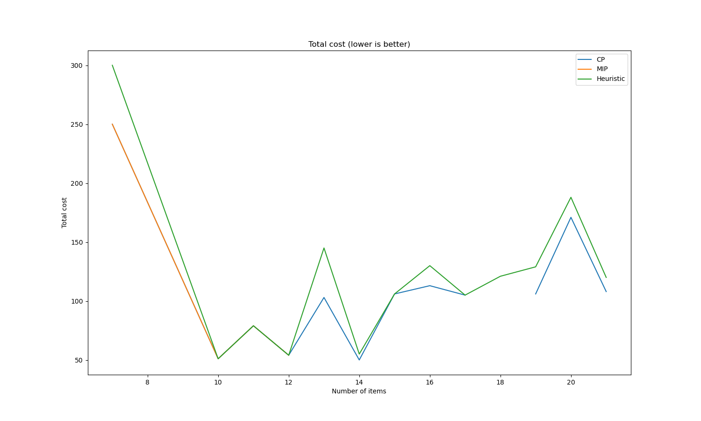
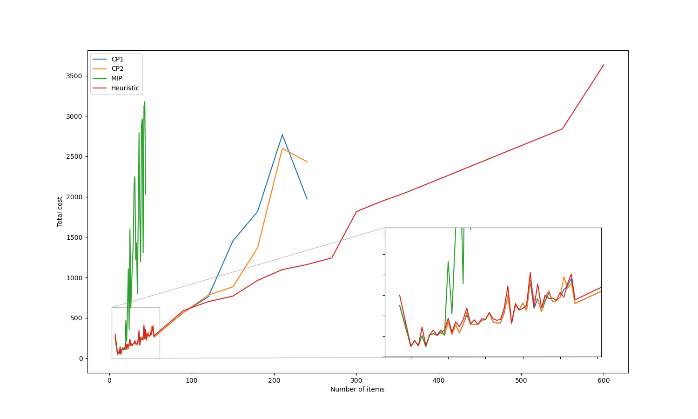
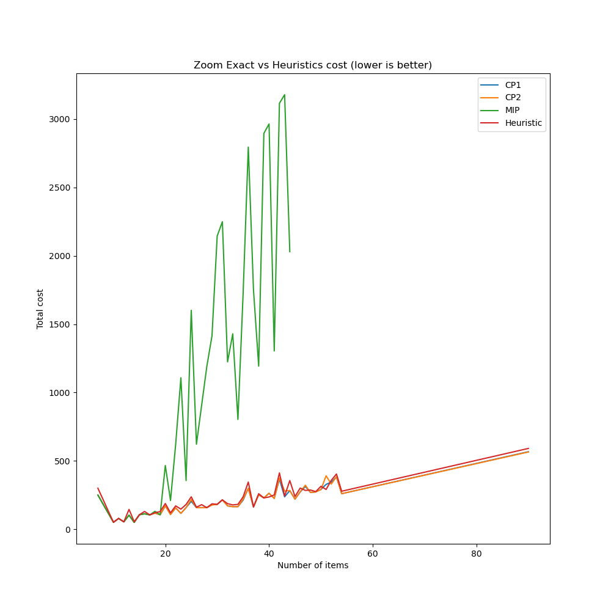
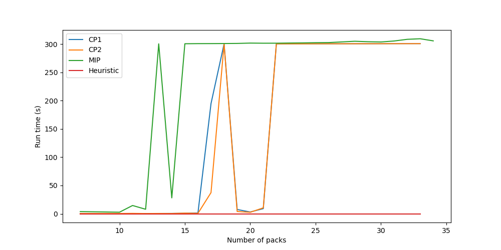
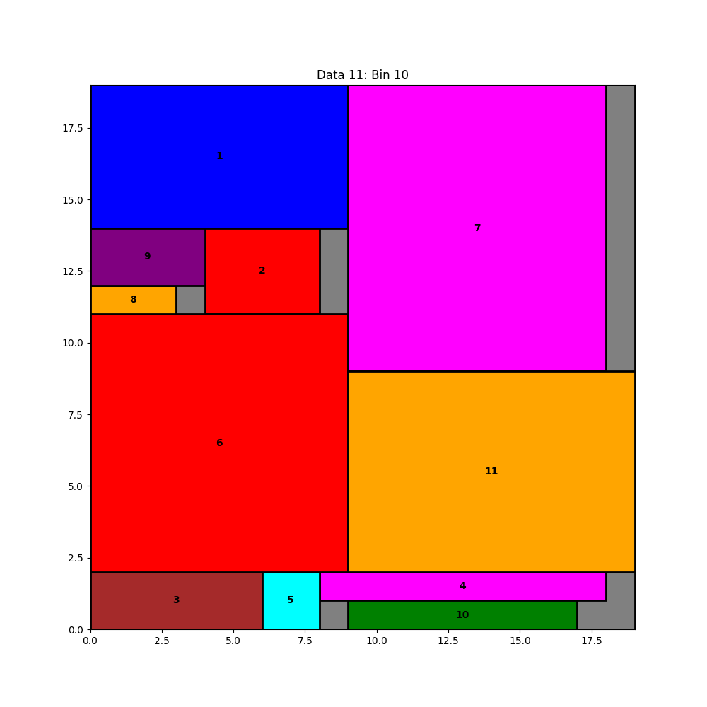

# Multiple-type, two-dimensional finite bin packing problem
This is a mini-project for topic 3 in Fundamentals of Optimization course of SoICT - HUST
## Problem
`K` trucks `1, 2, ..., K` are available for transporting `N` packages `1, 2, ..., N`. Each truck `k` has the container size of `Wk * Hk`. The dimensions of each package `i` are `wi * hi`. Packages that are placed in the same container must not overlap. Assume that the number K can be large, leading to a great number of trucks that are not being used. `Ck` represents the cost of using truck `k`. Find a solution that loads all the packages into those given trucks such that **the total cost of trucks used is minimal**.  

*Throughout our mini-project, some concepts are also being used instead of trucks (bins, cars) and packages (items)*

The input data format and how we generated them can be found [here](./input_data/README.md) 

## Our team
- Chu Minh Ha - 20210293
- Phan Dinh Nhat - 20210654
- Do Quang Minh - 20210579
- Nguyen Huu Duan - 20214951

## Modeling the problem
- CP model: Details are written in [this file](CP_model.pdf)
- MIP model: Details are written in [this file](MIP_model.pdf)
- Heuristic: Details are written in [this file](Heuristic.pdf)

## Folder structure
```
.
├── analyze                 # contains some analysis information
│   └── ...
├── CP_model.pdf            # how we model the problem
├── MIP_model.pdf
├── Heuristic.pdf
├── assets
├── figure                  # contains generated figures
│   ├── generated_CP
│   │   └── ...
│   |── generated_HEU
│   |   └── ...
│   └── gen_figure.py       # figure generator
├── input_data              # contains generated data
│   └── ...
├── presentation
├── results                 # contains results from solver
│   └── ...
├── script                  # script file for collect result and gen figure
│   └── ...
└── solver_file             # contains solver files
    ├── CP_model_solver
    │   └── ...
    ├── Heuristic
    │   └── ...
    └── MIP_model.py
```

## Results
Here, we just need **the number of used bins and the total cost**, so for the real running time results, we omitted the printing code of the detailed packing methods **(this affects quite a bit the actual runtime of the solver)**.
- The results for each model are shown in the `results` folder
- An overview of the results can be found [here](./results/results.pdf)
- CP and MIP model solvers only receive input data up to **600 packages**   
- You can use google colab to run our project like [this](https://colab.research.google.com/drive/1ouxqr2eeJTfJou74Oxw4Syih_zFGgm2p?usp=sharing)    

If you want to collect results by yourself, you can run the `collect_results` script by this command in the **root dir** of the repository:
```
./script/collect_results.sh {mode} {attempt}
```
Available solver modes: `CP1`, `CP2`, `MIP`, `HEU`

Example:
```
./script/collect_results.sh HEU 1
```  
The commmand above will collect the results created by [heuristic_main](/solver_file/Heuristic/) in the `1st attempt`     
  
  
  
**Note:**   
**- Read the script for more details**  
**- Change the attempt number for each attempt or the results will rewrite each other**

## Analysis
**Exact solution:**
- CP gives exact solutions for tests with sizes: `7*3`, `10*10`, `11*11`, `12*12`, `13*13`, `14*14`, `15*15`, `16*16`, `17*17`, `19*19`, `20*20`, `21*21`.
- MIP gives exact solutions for tests with sizes: `7*3`, `10*10`, `11*11`, `12*12`, `14*14`.  




**All:**
- CP cannot handle data sets larger than 240\*240. 
- MIP cannot handle data sets larger than 44\*44.
- Heuristic can handle all test cases (the largest test size is 10,000\*10,000).

**Comparing all results (total cost):**
- MIP gives the **worst** results.
- CP1 and CP2 give **nearly equivalent** results, but with larger data sets, CP2 gives better results.
- Heuristic gives really good results, with tests of size <100\*100 it is still a bit inferior to CP, but for all other tests it is significantly better.




**Comparing all run time:**

- MIP reaches the time limit of 300 seconds for all tests with size >= 15\*15.
- CP reaches the time limit of 300 seconds for all tests with size >= 22\*22.
- Heuristic has a very short run time, mostly under 1 second; even for a test size of 10,000\*10,000, it just takes about 5 seconds to provide the result.



**Therefore:**

- MIP is not good in terms of results and run time,
- CP is better than MIP, with better results and faster run time (in some early tests),
- Heuristic gives the best results in both cost and run time.

## Figure
We have generated 13 figures **(just data sizes from 7\*3 to 24\*24; larger ones are quite slow)** for the results of the CP solver and all figures for the Heuristic solver (none for the MIP due to its long running time).    
  
You can generate with this command:  
```
./script/gen_figure.sh {mode}
```
**Note: Currently, the script can only generate figure for the CP and Heuristic solver** 
  
  

